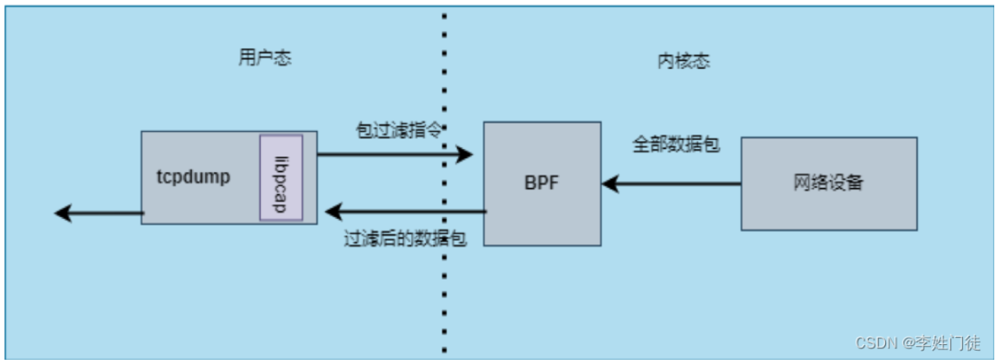
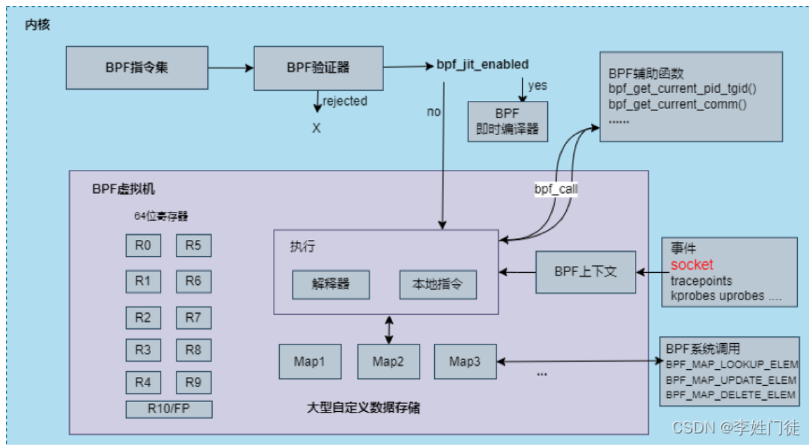
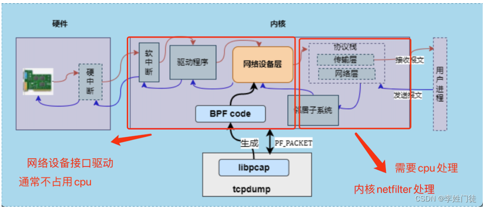
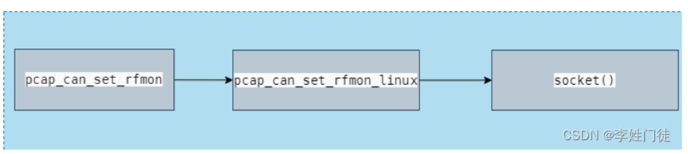
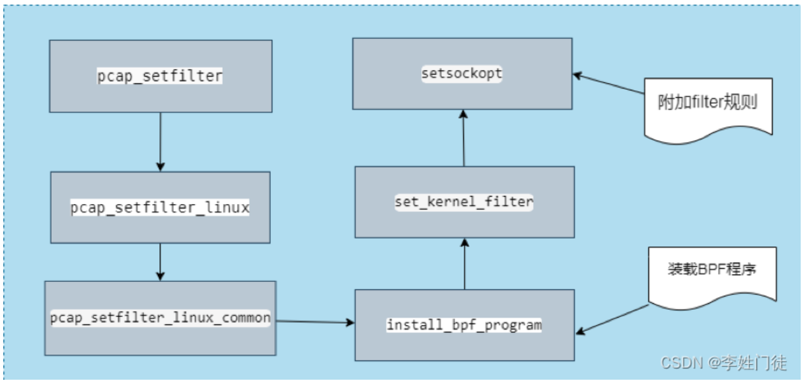
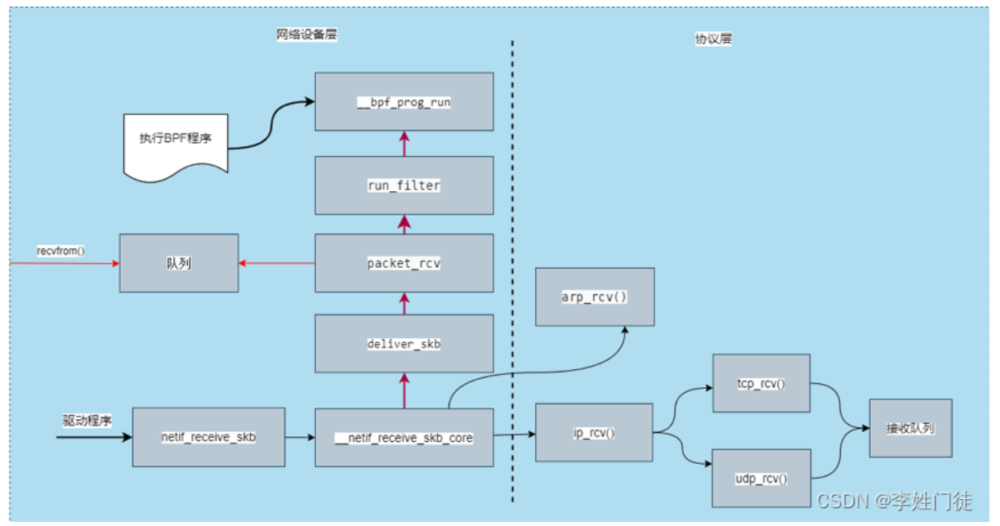
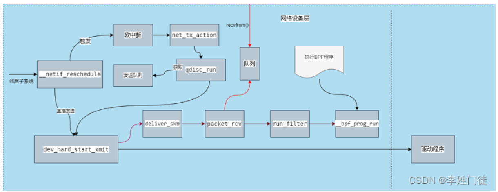

# Rust

##  基础入门

### 原生类型

rust中，定义各个变量的类型是其安全可控的关键，本节将对常用的一些原生类型进行说明。（primitives）

##### 标量类型（scalar type）

- 有符号整数：i代表有符号，主要包含：i8,16,32,64,128和isize（指针宽度）
- 无符号整数：u8-u128，usize
- 浮点数：f32,f64
- char：单个unicode字符，每个都是4字节
- bool：true，false
- 单元类型：一种基础符号，（），指代空元组。

注意：单元类型尽管是元组，但也被视为标量

##### 复合类型（compound type）

- 数组
- 元组

变量都是可以给出其类型声明的，其中标量的类型需要显示的突出在后缀。rust也会对没有声明的变量进行上下文推断（infer）。

```rust
fn main(){
    let logical:bool = true;
    let a_float:f32 = 1.0; //不声明,自动推断为f64
    let an_integer = 5i32; // 后缀说明,自动推断为i64
    
    //变量的类型不可被修改，但可以通过let屏蔽，如：
    let mut b_i32 = 5i32;
    mut = true;//报错
    let mut:bool =  true;//正确
}
```


### 自定义类型


### 变量绑定


### 类型系统


### 类型转换


### 表达式


### 流程控制


### 函数


### 模块


### crate


### 属性


### 泛型


### 作用域规则


### 特质 trait


### 使用macro_rules创建宏


### 错误处理


### 标准库类型


### 标准库更多介绍


### 测试


### 不安全操作


### 兼容性


### 补充


# Manjaro

## 系统指令

### 包管理

#### pacman

`pacman` 是 Arch Linux 及其衍生发行版中用于包管理的命令行工具。它主要用于安装、更新、卸载软件包以及管理系统的软件仓库。以下是一些基本的 `pacman` 指令及其用途：

```
sudo pacman -Sy #安装并更新软件包的数据库
sudo pacman -Syu # 更新并升级系统
pacman -Ss <search_term> # 搜索软件包
pacman -Si <package_name> # 查看软件包信息
pacman -Q # 列出已安装的软件包
```

```
sudo pacman -Rn <package_name> # 卸载软件包，同时删除配置文件
```

- 源配置

```
sudo pacman-mirrors -i -c China -m rank

sudo pacman -Syyu # 更新软件库
```

- AUR助手paru安装

AUR是Arch Linux社区维护的一个存储库，包含了大量的非官方或者实验性的软件包。通过克隆这个Git仓库，你获得了构建`paru`所需的全部源代码和构建脚本

```
sudo pacman -S --needed base-devel
git clone https://aur.archlinux.org/paru.git
cd paru
makepkg -si
#这个命令在paru目录下启动编译和打包过程。makepkg是一个用于从源代码构建Arch Linux软件包的工具。-s选项会在构建前检查依赖关系，并使用pacman安装缺少的依赖（如果之前没有使用--needed base-devel安装的话，这里可能会安装额外的依赖）。-i选项则在构建完成后立即安装生成的.pkg.tar.zst软件包。此步骤实质上是编译paru的源代码，并将其作为系统上的一个可执行程序安装，使得你可以开始使用paru来更方便地从AUR安装软件
```

配置出错了，更换了ustc源

```
sudo pacman -S archlinuxcn-keyring

archlinuxcn-keyring 包含了Arch Linux CN（中国）仓库的GPG密钥，
当你尝试从Arch Linux CN仓库安装软件时，系统需要验证软件包的完整性和真实性，以确保它们没有被篡改。安装 archlinuxcn-keyring 就是为了将这些必需的GPG密钥添加到你的系统中，从而使得 pacman 能够验证来自该仓库的软件包签名。
```


## 效率工具

### zsh主题修改

使用powerlevel10k进行zsh的主题管理

```
https://zhuanlan.zhihu.com/p/351037220
```

```
. ~/.zshrc 执行配置
```

- 中文的系统名称，但是~底下是英文

```
https://www.jianshu.com/p/73299b8e3f58
```

### neovim

#### 基本用法


##### Leetcode与提交


## 操作系统工具研究

### tcpdump

Tcpdump主要用于Linux系统和macOS中的网络流量分析，实现网络嗅探和监控TCP/IP数据包。它依赖于一个名为"libpcap"的库来有效地捕获网络流量。

捕获到的数据会被存储在一个名为"pcap"文件中，然后可以使用TCP/IP数据包分析工具（例如Wireshark）或其他命令行工具来进一步分析这些文件

#### 抓包的原理

```
内容来自：
https://blog.csdn.net/weixin_43845924/article/details/138294080
```

tcpdump是通过在用户态定义一些过滤规则，通过libpacp交给内核态的BPF。BPF利用这些规则将所有的网络包进行过滤，将满足规则的网络包传输至tcpdump



其中，BPF（Berkeley Packet Filter）是类Unix系统上数据链路层的一种原始接口，供一种网络数据包过滤方法。随着技术的发展，人们在BPF的基础上又提出了eBPF（extended BPF）。经过重新设计，eBPF 演进为一个通用执行引擎，在不更改内核代码的前提下，实时获取和修改操作系统的行为，可基于此开发性能分析工具、软件定义网络等诸多场景,

Linux 内核只运行eBPF，内核会将加载的cBPF字节码透明地转换成 eBPF再执行。eBPF新的设计针对现代硬件进行了优化，eBPF 生成的指令集比旧的 BPF 解释器生成的机器码执行得更快。

- eBPF程序需要挂载到某个内核路径（挂载点）才能被执行，常见的挂载点有：系统调用，内核函数进入/退出，内核跟踪点，网络数据包，主要包含以下四类：
  - 性能跟踪（kprobes/uprobes/tracepoints）
  - 网络（socket/xdp）
  - 容器（cgroup）
  - 安全（seccomp）

- tcpdump使用的包过滤指令为cBPF,内核将提交上来的cBPF字节码转化为eBPF后，加载到BPF虚拟机中，使用setsockopt()将BPF程序挂载到socket套接字上面，进而过滤数据包
- BPF代码是通过内核调用BPF运行函数__bpf_prog_run()来执行



##### 从内核层面来看整个tcpdump的抓包流程

- 在接收报文时，硬件层面出发硬中断，并触发内核的软中断，通过内核驱动程序进入网络设备层进行数据包处理。在输出到协议栈的网络层和传输层，最后被用户进程接收。

- 在发送报文时，通过内核的协议层，有邻居子系统实现L3层ip地址转化为L2层mac地址，然后进入网络设备层，数据包处理完成后，经驱动程序流转，最后由硬件将报文发出。

tcpdump抓取数据包，首先需要创建socket，用于接纳发送或接收的数据包，然后将过滤条件（BPF程序）注入到内核网络设备层，获取过滤后的数据包，在格式化处理。



其中注意两点内容：

- 硬件接收到网络包后，会放到内部队列，队列满后发出软中断，通知内核接收相关的流量包。内核接收后，对应的队列清空以继续接收后续的流量包。【硬件发送软中断，不消耗CPU】
- 内核接收到软中断信号后，会调用CPU资源以接收相关流量包，放到协议栈并进行后续处理。如果软中断很频繁，那么就会消耗大量的CPU资源，特别是内核响应软中断绑定到固定CPU核时，性能下降表现明显。【CPU真实的取流量进行处理】

步骤1.创建socket。tcpdump会创建出一个socket，名为PF_PACKET，用于接收L2层的网络包进行抓包分析，（复制了系统中的网络包）



步骤2.挂载BPF程序。使用libpcap库的pcap_compile（）函数将用户制定的过滤策略转换为BPF代码，然后使用pcap_setfilter（）函数调用install_bpf_program()函数装载BPF程序，install_bpf_program()函数调用系统调用函数setsockopt()，设置SO_ATTACH_FILTER参数将BPF程序下发给内核底层，将规则注入到内核，设置过滤器，从而让规则生效。


- 抓包分析
- 应用接收报文时，在网络设备层，驱动程序首先调用内核函数netif_receive_skb()，通过deliver_skb()调用回调函数packet_rcv()，并使用BPF运行函数__bpf_prog_run()，来执行BPF程序过滤数据包，然后将数据包存入队列，最终复制数据包给tcpdump。而应用接收数据包则根据包的协议，选择udp或者tcp将报文送到用户进程。
  

- 发送报文时

应用在发送报文时，首先通过邻居子系统进入网络设备层，然后调用内核函数dev_hard_start_xmit（），该函数同样使用网络收包流程中使用的deliver_skb()函数调用回调函数packet_rcv()，并通过调用BPF运行函数__bpf_prog_run()，来执行BPF程序过滤数据包，然后将数据包存入队列，最终复制数据包给tcpdump。而应用发送数据包则通过驱动程序发送出去。
应用在发送报文时，首先通过邻居子系统进入网络设备层，然后调用内核函数dev_hard_start_xmit（），该函数同样使用网络收包流程中使用的deliver_skb()函数调用回调函数packet_rcv()，并通过调用BPF运行函数__bpf_prog_run()，来执行BPF程序过滤数据包，然后将数据包存入队列，最终复制数据包给tcpdump。而应用发送数据包则通过驱动程序发送出去。
<<<<<<< HEAD


#### 相关技术

这部分设计到系统性能跟踪：eBPF、网络IO等内容，首先将从网络IO入手，深入挖掘网路这部分内容。后续这部分仍可跟rust进行结合


## Bug

### python相关

#### pacman和pip的包管理冲突

```none
error: externally-managed-environment
```

```
https://stackoverflow.com/questions/75608323/how-do-i-solve-error-externally-managed-environment-every-time-i-use-pip-3
```

=======

>>>>>>> 41d08ea417c35d945deb4b041bf2e04ce7c75ba2
